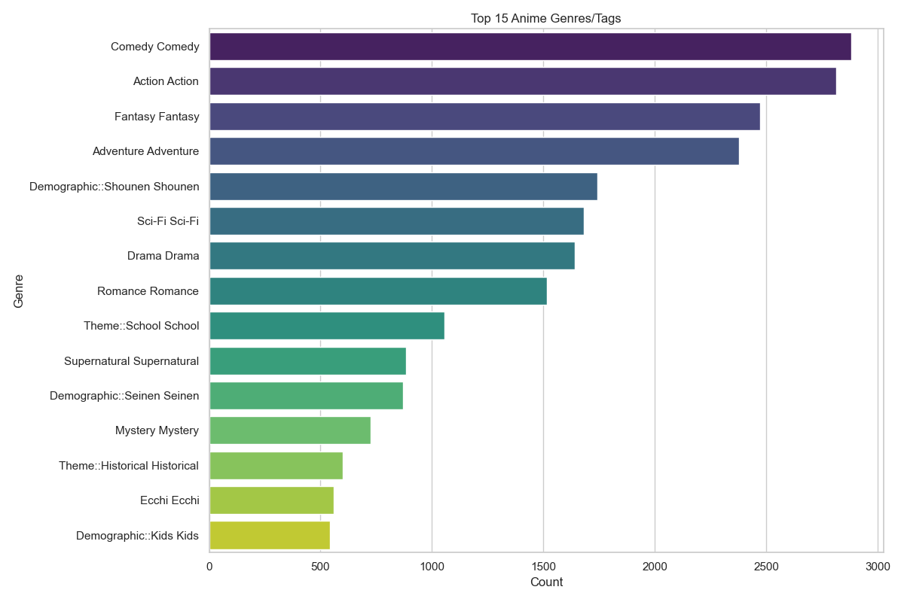

# Anime Dataset Analysis Report

**Prepared by:** Data Analysis Team  
**Date:** January 21, 2026

---

## Executive Summary

This report presents a comprehensive exploratory data analysis (EDA) of an anime dataset containing **9,999 anime titles** sourced from MyAnimeList. The analysis covers score distributions, release trends over time, genre popularity, and the relationship between audience size and ratings.

### Key Findings at a Glance

| Metric | Value |
|--------|-------|
| Total Anime Analyzed | 9,999 |
| Average Score | 6.98 / 10 |
| Most Popular Anime | Shingeki no Kyojin (Attack on Titan) |
| Highest Rated Anime | Sousou no Frieren (Frieren: Beyond Journey's End) |

---

## 1. Score Distribution Analysis

### Overview
The first analysis examines how anime are rated across the dataset. Scores range from 1 to 10, with most falling between 5 and 8.

### Chart: Distribution of Anime Scores

### Key Observations
- **Central Tendency:** The distribution is roughly bell-shaped, centered around a score of **7.0**.
- **Skew:** There is a slight left skew, indicating that extremely low-rated anime are less common than average to above-average ones.
- **Insight:** Most anime receive "average" to "good" ratings. Truly exceptional (9+) or terrible (<4) scores are rare.

---

## 2. Anime Release Trends Over Time

### Overview
This section analyzes how the volume of anime production has changed over the decades.

### Chart: Number of Anime Released Per Year

### Key Observations
- **Growth Trend:** There has been an exponential increase in anime production since the early 2000s.
- **Peak Years:** The dataset shows a significant spike in releases around 2015-2022.
- **Historical Context:** Before 1990, anime releases were relatively sparse compared to the modern era.
- **Insight:** The anime industry has undergone massive expansion, likely driven by digital distribution, streaming platforms, and global audience growth.

---

## 3. Genre Popularity Analysis

### Overview
Anime are tagged with various genres and themes. This analysis identifies the most frequently occurring genres.

### Chart: Top 15 Anime Genres/Tags

### Key Observations
- **Dominant Genres:** Action, Comedy, and Fantasy are among the most common genres.
- **Demographic Tags:** "Shounen" (targeted at young males) appears frequently, reflecting its commercial popularity.
- **Niche Themes:** Specific themes like "Isekai" (another world) and "Mecha" also have significant representation.
- **Insight:** The market is dominated by action-oriented and escapist content, catering to broad audience preferences.

---

## 4. Popularity vs. Score Relationship

### Overview
Does higher popularity (more members/viewers) correlate with better ratings? This analysis groups anime by their member count and calculates the average score for each group.

### Chart: Average Score by Popularity Group

### Key Observations
- **Clear Correlation:** As the popularity group increases (from <10k members to >1M members), the average score increases significantly.
- **Low Popularity Group (<10k):** Average score is around **6.5**.
- **High Popularity Group (>1M):** Average score jumps to approximately **8.0+**.
- **Insight:** Popular anime tend to be higher quality (or perceived as such). This could be because:
  1. Quality attracts viewers.
  2. Popular anime receive more attention and marketing.
  3. There is a self-selection bias where viewers seek out well-reviewed content.

---

## 5. Data Quality Notes

During the data cleaning process, the following issues were addressed:

| Issue | Action Taken |
|-------|--------------|
| Missing Scores | Retained as NaN (not imputed) |
| Invalid Dates | Coerced to NaT |
| Non-numeric Episodes | Converted to NaN |
| Duplicate Anime IDs | Removed (1 duplicate found) |
| Missing Entity Names | Dropped (1 entity) |

---

## Conclusion

The anime industry has experienced remarkable growth, particularly in the 21st century. The data reveals a healthy ecosystem with diverse genres, though Action, Comedy, and Fantasy dominate the landscape.

The relationship between popularity and quality is noteworthy: anime with larger audiences consistently receive higher scores. Whether this is due to inherent quality or audience amplification effects remains an interesting question for further study.

### Recommendations for Further Analysis
1. **Time-based Quality Trends:** Investigate if average scores have changed over decades.
2. **Studio Performance:** Analyze which studios produce the highest-rated anime.
3. **Seasonal Patterns:** Explore if certain release seasons (Winter, Spring, Summer, Fall) affect ratings.

---

*Report generated using Python, Pandas, Seaborn, and Matplotlib.*
